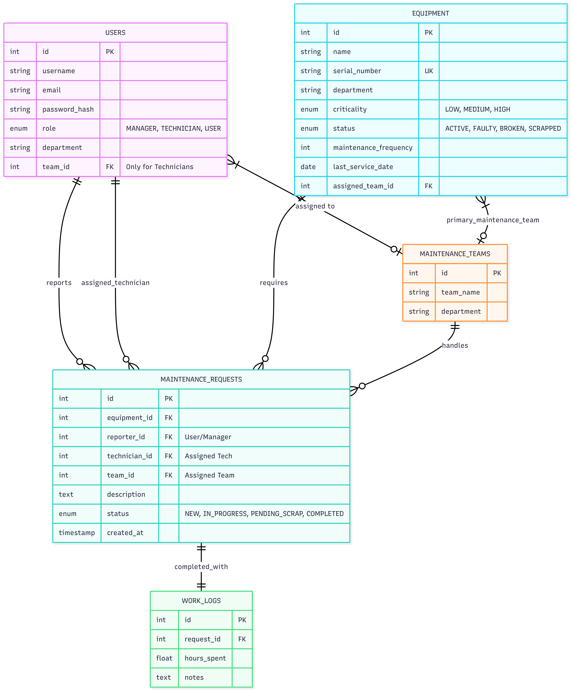

# Maintenance System

A comprehensive Maintenance Management System built with a React frontend and Node.js/MySQL backend. This application allows for managing equipment, maintenance teams, and repair requests with role-based access control (RBAC).

## Tech Stack

- **Frontend:** React, Vite, TailwindCSS, React Router, Axios
- **Backend:** Node.js, Express, MySQL2, JWT Authentication
- **Database:** MySQL

## Prerequisites

- **Node.js**: v14+ (v18+ recommended)
- **MySQL**: 8.0+

## Installation & Setup

### 1. Database Setup

1.  Ensure MySQL is running.
2.  Login to your MySQL instance:
    ```bash
    mysql -u root -p
    ```
3.  Create the database:
    ```sql
    CREATE DATABASE maintenance_system;
    ```
4.  Exit the MySQL shell.

### 2. Backend Setup

1.  Navigate to the `backend` directory:
    ```bash
    cd backend
    ```
2.  Install dependencies:
    ```bash
    npm install
    ```
3.  Create a `.env` file in the `backend` directory with your database credentials:
    ```env
    DB_HOST=localhost
    DB_USER=root
    DB_PASSWORD=your_password
    DB_NAME=maintenance_system
    PORT=5000
    JWT_SECRET=your_jwt_secret_key
    ```
4.  Initialize the database schema:
    ```bash
    node init_schema.js
    ```
5.  Start the backend server:
    ```bash
    npm start
    # or for development with auto-reload:
    npx nodemon app.js
    ```
    The server should run on `http://localhost:5000`.

### 3. Frontend Setup

1.  Open a new terminal and navigate to the `frontend` directory:
    ```bash
    cd frontend
    ```
2.  Install dependencies:
    ```bash
    npm install
    ```
3.  Start the development server:
    ```bash
    npm run dev
    ```
    The application should be accessible at `http://localhost:5173`.

## Features

- **Role-Based Access Control:** Distinct views and permissions for Managers, Technicians, and Employees.
- **Dashboard:** Interactive statistics and graphs for managers.
- **Equipment Management:** Create, track, and manage equipment details.
- **Maintenance Requests:** Submit and track repair tickets with priority levels.
- **Team Management:** Organize technicians into specialized teams.
- **Fault Reporting:** Easy-to-use modal for reporting equipment issues.





## Debugging

If you encounter issues during setup:
- **Database Connection:** Verify credentials in `backend/.env`.
- **Schema Errors:** Ensure `init_schema.js` ran successfully. You can inspect tables using `mysql` command line or a GUI tool like Workbench/Beekeeper.
- **CORS Issues:** The backend is configured to allow requests from the frontend, but ensure no browser extensions or network policies are blocking `localhost`.

## License

ISC
